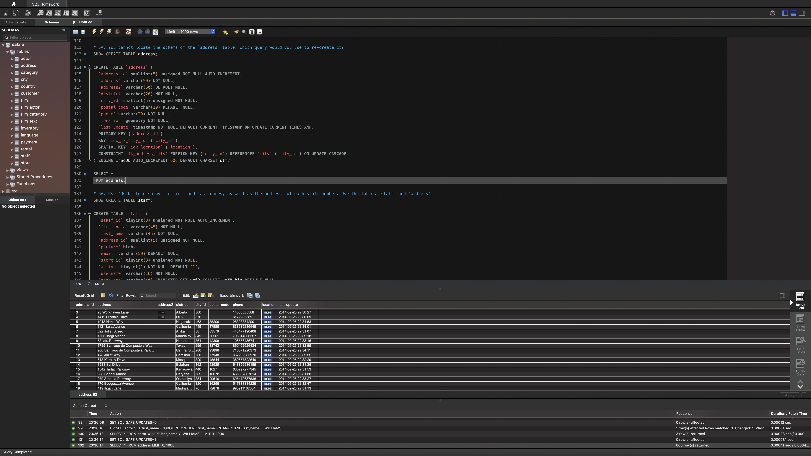
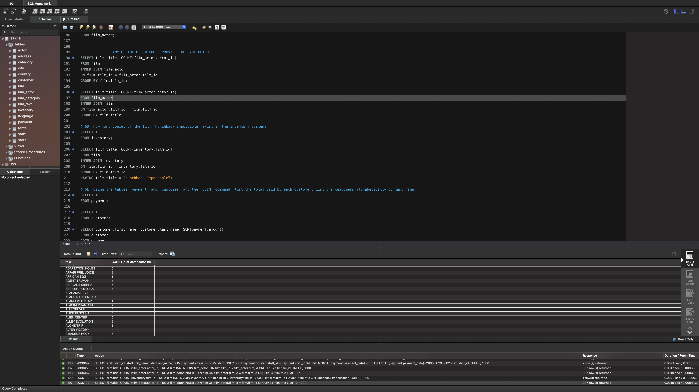
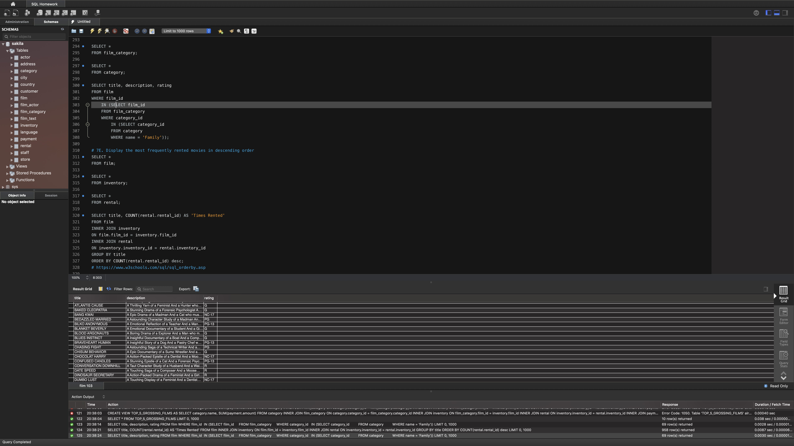
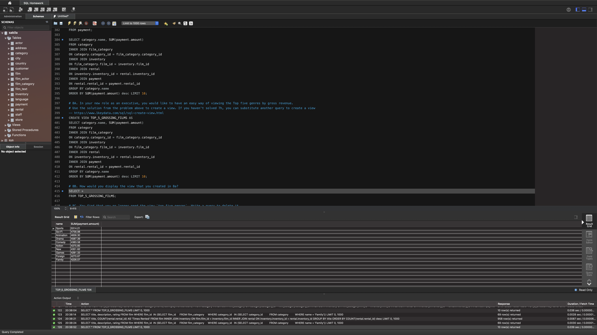

# Sakila-SQL

Used as an introductory min-project into SQL, this assignment looks into the infamous Sakila-SQL Database to parse information using cross-functional categories.
--------------------------------------------------------------------------------
Below are images as previews for the analysis:
--------------------------------------------------------------------------------

--------------------------------------------------------------------------------

--------------------------------------------------------------------------------

--------------------------------------------------------------------------------

--------------------------------------------------------------------------------
